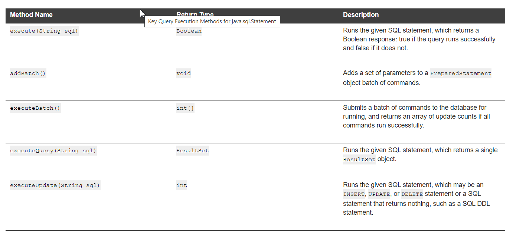
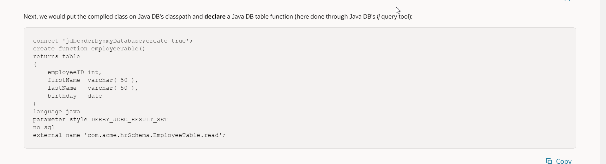
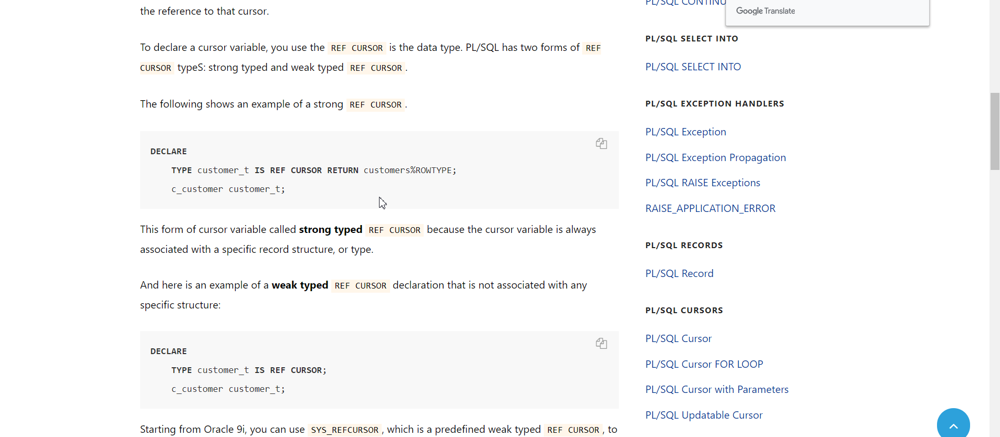
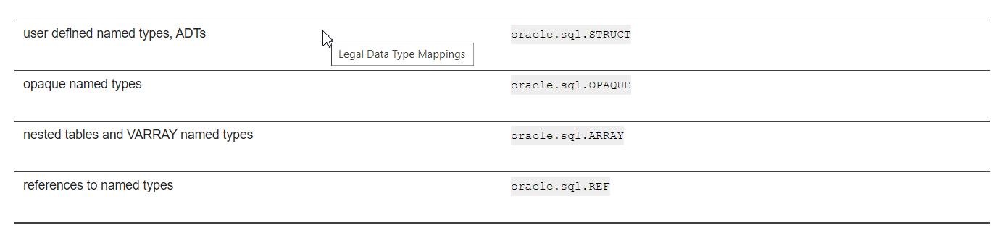

4.1.3.1 Features of ResultSet Objects
Scrollability refers to the ability to move backward as well as forward through
 a result set. You can also move to any particular position in the result set, through either 
 relative positioning or absolute positioning. Relative positioning lets you move a specified number 
 of rows forward or backward from the current row. Absolute positioning lets you move to a specified 
 row number, counting from either the beginning or the end of the result set.

When creating a scrollable or positionable result set, you must also specify sensitivity. 
This refers to the ability of a result set to detect and reveal changes made to the underlying 
database from outside the result set. A sensitive result set can see changes made to the database 
while the result set is open, providing a dynamic view of the underlying data. Changes made to 
the underlying column values of rows in the result set are visible. Updatability refers to the ability 
to update data in a result set and then copy the changes to the database. This includes inserting new 
rows into the result set or deleting existing rows. A result set may be updatable or read-only.

4.1.3.2 Summary of Result Set Object Types
Scrollability and sensitivity are independent of updatability,
 and the three result set types and two concurrency types combine
 for the following six result set categories:

<li>Forward-only/read-only</li>
<li>Forward-only/updatable </li>

<li>Scroll-sensitive/read-only</li>

<li>Scroll-sensitive/updatable</li>

<li>Scroll-insensitive/read-only</li>

<li>Scroll-insensitive/updatable</li>

Example 4-2 demonstrates how to declare a scroll-sensitive and read-only ResultSet object.

`stmt = conn.createStatement(ResultSet.TYPE_SCROLL_SENSITIVE, ResultSet.CONCUR_READ_ONLY);`

`stmt = conn.createStatement(ResultSet.TYPE_SCROLL_SENSITIVE, 
                             ResultSet.CONCUR_READ_ONLY);
 query =
 "SELECT * FROM Employees WHERE UPPER(first_name) LIKE \'%" + name + "%\'" +
 " OR UPPER(last_name) LIKE \'%" + name + "%\' ORDER BY employee_id";`
 
 
 